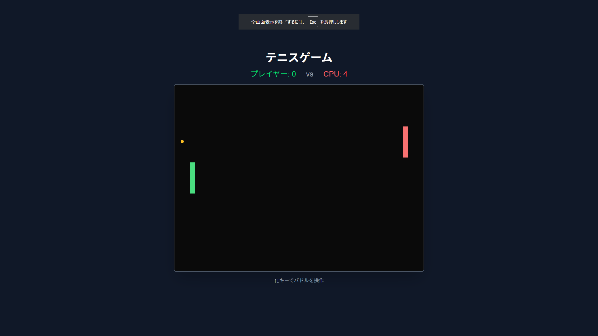

# テニスゲーム 🎾



## 概要

シンプルで楽しいブラウザベースの2Dテニスゲームです。プレイヤーは緑のパドルを操作してCPU（赤のパドル）と対戦します。

## デモ

[🎮 今すぐプレイ](https://app002-tennis-game.vercel.app)

## 特徴

- 🎮 シンプルで直感的な操作
- 🤖 CPUとの対戦モード
- ⚡ リアルタイムの物理演算
- 🏆 10点先取で勝利
- 📱 レスポンシブデザイン

## 遊び方

1. 「ゲームスタート」ボタンをクリック
2. キーボードの矢印キーで操作：
   - ↑ : パドルを上に移動
   - ↓ : パドルを下に移動
3. ボールを打ち返してCPU側のコートに入れると得点
4. 先に10点取った方が勝利！

## 技術スタック

- **フレームワーク**: Next.js 15.5.2
- **言語**: TypeScript
- **スタイリング**: Tailwind CSS
- **デプロイ**: Vercel
- **パッケージマネージャー**: npm

## インストール & 起動

### 必要な環境

- Node.js 18.x 以上
- npm または yarn

### ローカルで実行

```bash
# リポジトリをクローン
git clone https://github.com/takamiya1021/app002-tennis-game.git

# ディレクトリに移動
cd app002-tennis-game

# 依存関係をインストール
npm install

# 開発サーバーを起動
npm run dev
```

ブラウザで http://localhost:3000 を開いてください。

## ビルド & デプロイ

### プロダクションビルド

```bash
npm run build
npm run start
```

### Vercelへのデプロイ

このプロジェクトはVercelで簡単にデプロイできます：

[](https://vercel.com/new/clone?repository-url=https://github.com/takamiya1021/app002-tennis-game)

## ゲームの仕組み

### 物理演算
- ボールの速度は徐々に加速します
- パドルに当たった位置によってボールの角度が変わります
- 上下の壁でボールが跳ね返ります

### CPU AI
- ボールの位置を追跡して移動
- 適度な難易度に調整された速度制限

## プロジェクト構造

```
app002-tennis-game/
├── app/
│   ├── page.tsx        # メインゲームコンポーネント
│   ├── layout.tsx      # レイアウト定義
│   └── globals.css     # グローバルスタイル
├── public/
│   └── screenshot.png  # ゲームスクリーンショット
├── package.json        # プロジェクト設定
└── README.md          # このファイル
```

## 今後の改善予定

- [ ] サウンドエフェクトの追加
- [ ] 難易度選択機能
- [ ] 2人プレイモード
- [ ] スマートフォン対応（タッチ操作）
- [ ] ハイスコア記録機能
- [ ] パワーアップアイテム

## ライセンス

MIT

## 作者

[@takamiya1021](https://github.com/takamiya1021)

---

🎮 楽しんでプレイしてください！フィードバックや改善提案はIssuesまでお願いします。